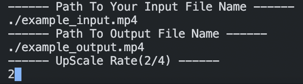

<a name="readme-top"></a>
<!--
*** Thanks for checking out the Best-README-Template. If you have a suggestion
*** that would make this better, please fork the repo and create a pull request
*** or simply open an issue with the tag "enhancement".
*** Don't forget to give the project a star!
*** Thanks again! Now go create something AMAZING! :D
-->


<!-- PROJECT SHIELDS -->
<!--
*** I'm using markdown "reference style" links for readability.
*** Reference links are enclosed in brackets [ ] instead of parentheses ( ).
*** See the bottom of this document for the declaration of the reference variables
*** for contributors-url, forks-url, etc. This is an optional, concise syntax you may use.
*** https://www.markdownguide.org/basic-syntax/#reference-style-links
-->
<p id="readme-top"></p>

[![Contributors][contributors-shield]][contributors-url]
[![Forks][forks-shield]][forks-url]
[![Stargazers][stars-shield]][stars-url]
[![Issues][issues-shield]][issues-url]
<!-- PROJECT LOGO -->
<div align="center">

<h3 align="center">Anime UpScaler Script v0.1</h3>

  <p align="center">
    ENG: Simple script to upscale anime video with Neural Network.
    RU: Простой скрипт для апскейлинга аниме видеоформата с помощью нейронных сетей.
    <br />
    <a href="https://github.com/nmequalmn/anime-upscaler/issues">Report Bug</a>
  </p>
</div>


<!-- TABLE OF CONTENTS -->
  <summary>Table of Contents (Содержание)</summary>
  <ol>
    <li>
      <a href="#getting-started">Getting Started (Установка)</a>
      <ul>
        <li><a href="#prerequisites">Prerequisites (Установка библиотек)</a></li>
        <li><a href="#installation">Installation (Установка репозитория)</a></li>
      </ul>
    </li>
    <li><a href="#usage">Usage (Использование)</a></li>
    <li><a href="#res">Used Resources (Использованные ресурсы)</a></li>
    <li><a href="#contact">Contact (Связь со мной)</a></li>
  </ol>


<!-- GETTING STARTED -->
<p id="getting-started"> </p>

## Getting Started (Установка)

### Prerequisites (Установка библиотек)
<p id="prerequisites"> </p>

* <a href="https://www.python.org/downloads/">Install Python (Установить Python)</a>
* Install FFmpeg (Установка FFmpeg) 
</br>
<a href="https://www.geeksforgeeks.org/how-to-install-ffmpeg-on-windows/">Windows</a> | <a href="http://jollejolles.com/install-ffmpeg-on-mac-os-x/">macOS</a>

* Installing libraries (Установка библиотек)
  ```sh
  pip install opencv-python numpy ffmpeg moviepy
  ```

### Installation (Установка репозитория)
<p id="installation"> </p>

Clone the repo (Клонирование репозитория)
   ```sh
   git clone https://github.com/nmequalmn/anime-upscaler.git
   ```

<p align="right">(<a href="#readme-top">back to top</a>)</p>


<!-- USAGE EXAMPLES -->
## Usage (Использование)
<p id="usage"> </p>

 1. Run main.py (Запустите main.py)
    ```sh
    python main.py
    ```
 2. Type Input Data (Введите входные данные)
 </br>

    

<p align="right">(<a href="#readme-top">back to top</a>)</p>


<!-- LICENSE -->
## Used Resources (Использованные ресурсы)
<p id="res"> </p>

#### 1. <a href="https://github.com/xinntao/Real-ESRGAN-ncnn-vulkan">Real-ESRGAN-ncnn-vulkan (адаптированная нейронка).</a>
#### 2. <a href="https://github.com/othneildrew/Best-README-Template">Best-README-Template (шаблон readme). </a> 

<p align="right">(<a href="#readme-top">back to top</a>)</p>


<!-- CONTACT -->
## Contact (Связь со мной)
<p id="contact"> </p>

My telegram - @nmequalmn. Email - meregodz@gmail.com.

Project Link: [https://github.com/nmequalmn/anime-upscaler](https://github.com/nmequalmn/anime-upscaler)

<p align="right">(<a href="#readme-top">back to top</a>)</p>


<!-- MARKDOWN LINKS & IMAGES -->
<!-- https://www.markdownguide.org/basic-syntax/#reference-style-links -->
[contributors-shield]: https://img.shields.io/github/contributors/nmequalmn/anime-upscaler.svg?style=for-the-badge
[contributors-url]: https://github.com/nmequalmn/anime-upscaler/graphs/contributors
[forks-shield]: https://img.shields.io/github/forks/nmequalmn/anime-upscaler.svg?style=for-the-badge
[forks-url]: https://github.com/nmequalmn/anime-upscaler/network/members
[stars-shield]: https://img.shields.io/github/stars/nmequalmn/anime-upscaler.svg?style=for-the-badge
[stars-url]: https://github.com/nmequalmn/anime-upscaler/stargazers
[issues-shield]: https://img.shields.io/github/issues/nmequalmn/anime-upscaler.svg?style=for-the-badge
[issues-url]: https://github.com/nmequalmn/anime-upscaler/issues
[license-shield]: https://img.shields.io/github/license/nmequalmn/anime-upscaler.svg?style=for-the-badge
[license-url]: https://github.com/nmequalmn/anime-upscaler/blob/master/LICENSE.txt
[linkedin-shield]: https://img.shields.io/badge/-LinkedIn-black.svg?style=for-the-badge&logo=linkedin&colorB=555
[linkedin-url]: https://linkedin.com/in/linkedin_username
[product-screenshot]: images/screenshot.png
[Next.js]: https://img.shields.io/badge/next.js-000000?style=for-the-badge&logo=nextdotjs&logoColor=white
[Next-url]: https://nextjs.org/
[React.js]: https://img.shields.io/badge/React-20232A?style=for-the-badge&logo=react&logoColor=61DAFB
[React-url]: https://reactjs.org/
[Vue.js]: https://img.shields.io/badge/Vue.js-35495E?style=for-the-badge&logo=vuedotjs&logoColor=4FC08D
[Vue-url]: https://vuejs.org/
[Angular.io]: https://img.shields.io/badge/Angular-DD0031?style=for-the-badge&logo=angular&logoColor=white
[Angular-url]: https://angular.io/
[Svelte.dev]: https://img.shields.io/badge/Svelte-4A4A55?style=for-the-badge&logo=svelte&logoColor=FF3E00
[Svelte-url]: https://svelte.dev/
[Laravel.com]: https://img.shields.io/badge/Laravel-FF2D20?style=for-the-badge&logo=laravel&logoColor=white
[Laravel-url]: https://laravel.com
[Bootstrap.com]: https://img.shields.io/badge/Bootstrap-563D7C?style=for-the-badge&logo=bootstrap&logoColor=white
[Bootstrap-url]: https://getbootstrap.com
[JQuery.com]: https://img.shields.io/badge/jQuery-0769AD?style=for-the-badge&logo=jquery&logoColor=white
[JQuery-url]: https://jquery.com 
